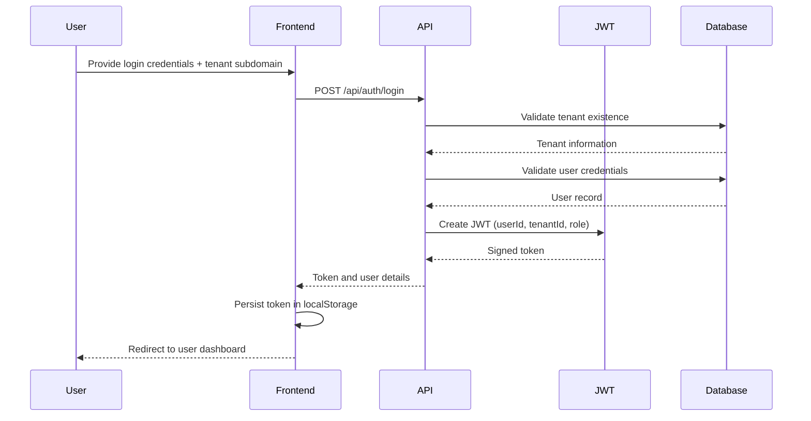
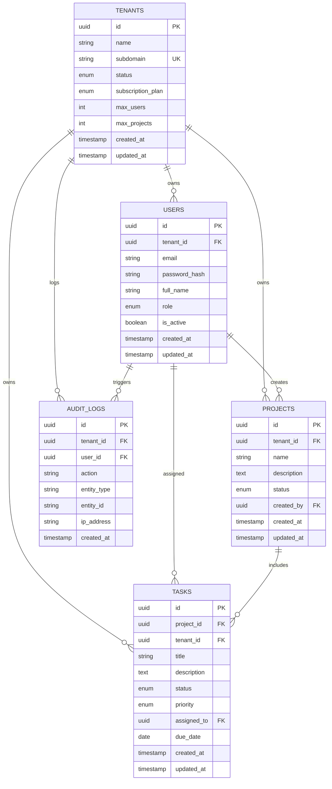
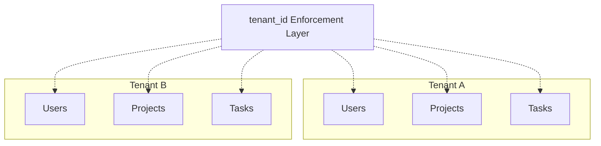

# Architecture Document

## Overall System Architecture

### High-Level Architecture Overview

```mermaid
graph TB
    subgraph "Client Layer"
        Browser[User Web Browser]
    end
    
    subgraph "Frontend Layer - Port 3000"
        Frontend[Frontend Application<br/>React (Vite) + React Router]
    end
    
    subgraph "Backend Layer - Port 5000"
        API[API Server<br/>Express.js + Node.js + TypeScript]
        Auth[JWT-Based Authentication<br/>Middleware]
        RBAC[Role-Based Access Control<br/>Middleware]
        Tenant[Tenant-Aware Data Isolation<br/>Middleware]
    end
    
    subgraph "Database Layer - Port 5432"
        DB[(PostgreSQL 15<br/>Multi-Tenant Storage)]
    end
    
    Browser -->|HTTP/HTTPS Requests| Frontend
    Frontend -->|REST APIs<br/>JSON| API
    API --> Auth
    Auth --> RBAC
    RBAC --> Tenant
    Tenant --> DB
```

### Architecture Breakdown

**Client Layer:**

* End users interact with the system through modern web browsers using HTTP or HTTPS.

**Frontend Layer (Port 3000):**

* Built using React 18 with the Vite build system
* Client-side routing managed through React Router
* Route protection enforced via authentication guards
* Fully responsive and user-friendly interface

**Backend Layer (Port 5000):**

* RESTful API developed using Express.js and TypeScript
* JWT middleware to authenticate incoming requests
* Role-based authorization to restrict access by user role
* Tenant isolation layer to ensure strict data separation
* Centralized error handling for consistent responses

**Database Layer (Port 5432):**

* PostgreSQL 15 used as the primary relational database
* Supports multi-tenancy using tenant-specific identifiers
* Prisma ORM handles queries, migrations, and seeding

### User Authentication Flow



## Database Design

### Entity Relationship Model



### Table Descriptions

**tenants**

* Holds organization-level details
* Each tenant is uniquely identified by a subdomain
* Tracks subscription plans, usage limits, and status

**users**

* Stores authentication and profile information
* Linked to tenants via tenant_id (nullable for super admins)
* Enforces unique email per tenant
* Supports roles: super_admin, tenant_admin, user

**projects**

* Represents projects owned by a tenant
* Created and managed by users
* Can be active, archived, or completed

**tasks**

* Individual work items under projects
* Associated with both project and tenant
* Supports priority levels and status tracking

**audit_logs**

* Maintains an audit trail for security and compliance
* Logs user actions along with metadata such as IP address

### Tenant Data Isolation Model



**Isolation Strategy:**

* All tenant-owned records include a tenant_id column
* JWT tokens provide tenant context for every request
* Middleware ensures queries are always tenant-scoped
* Super admins are exempt from tenant restrictions
* Foreign keys and indexes improve integrity and performance

## API Design

### Available API Endpoints

**Authentication**

* POST /api/auth/register-tenant – Create a new tenant
* POST /api/auth/login – Authenticate a user
* GET /api/auth/me – Retrieve logged-in user details
* POST /api/auth/logout – Logout user

**Tenant Management**

* GET /api/tenants/:tenantId – Fetch tenant details
* PUT /api/tenants/:tenantId – Modify tenant information
* GET /api/tenants – View all tenants (super admin only)

**User Management**

* POST /api/tenants/:tenantId/users – Add tenant user
* GET /api/tenants/:tenantId/users – List tenant users
* PUT /api/users/:userId – Update user profile
* DELETE /api/users/:userId – Remove user

**Project Management**

* POST /api/projects – Create project
* GET /api/projects – List projects
* PUT /api/projects/:projectId – Update project
* DELETE /api/projects/:projectId – Delete project

**Task Management**

* POST /api/projects/:projectId/tasks – Create task
* GET /api/projects/:projectId/tasks – Retrieve tasks
* PATCH /api/tasks/:taskId/status – Change task status
* PUT /api/tasks/:taskId – Edit task
* DELETE /api/tasks/:taskId – Remove task

**System**

* GET /api/health – Application health check

### API Security Model

**Authentication:**

* Stateless JWT-based authentication
* Tokens valid for 24 hours
* Payload includes userId, tenantId, and role
* Sent using Authorization: Bearer <token>

**Authorization Levels:**

* Public: No authentication needed
* Authenticated: Valid JWT required
* Role-Specific: Access controlled by role
* Tenant-Scoped: Data access limited to tenant

**Request Lifecycle:**

1. Client sends request with JWT
2. Token is verified by auth middleware
3. Role permissions are validated
4. Tenant scope is enforced
5. Controller executes business logic
6. Standardized response returned

### Standard Response Structure

**Successful Response**

```json
{
  "success": true,
  "message": "Optional description",
  "data": {}
}
```

**Error Response**

```json
{
  "success": false,
  "message": "Error details"
}
```

**HTTP Status Codes Used:**

* 200 – OK
* 201 – Created
* 400 – Validation failure
* 401 – Unauthorized
* 403 – Access denied
* 404 – Resource not found
* 409 – Conflict
* 500 – Server error


---

Refer to **API.md** for in-depth API documentation.

Refer to **images/diagrams.md** for exported diagram images.